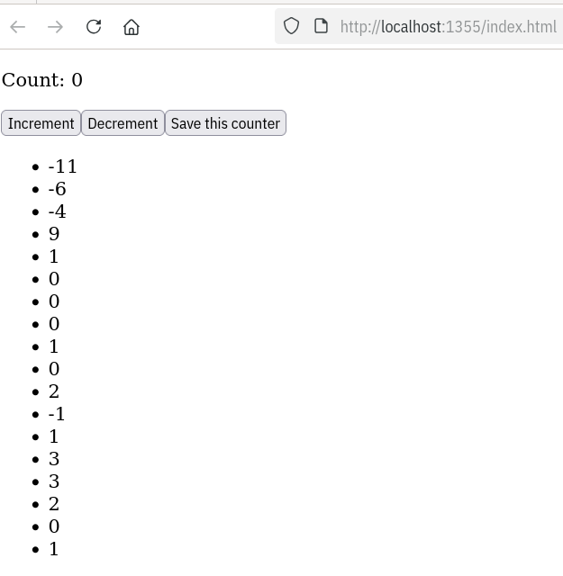

# Buildless Preact App (with in-browser test suite)

## TLDR: How to run this

`make serve`
`make test`

You will need `make`, `openssl`, `python3` and `m4` avaialable on your machine,
which you likely do. You'll also need a modern browser, which you likely have.

For extra quality-of-life features, you'll need
[watchexec](https://github.com/watchexec/watchexec) for rebuilding-on-save, as
well as [deno](http://deno.land) for linting.


## This is a proof-of-concept

I set out to create a web-app development flow that avoids the use of npm,
node, and transpilation/bundling tools. In short, I wanted a
[buildless](https://www.spicyweb.dev/buildless-modern-development-workflows-are-this-close-to-a-reality/)
development environment.

The app in question is a twist on the basic [Preact](https://preactjs.com/)
counter demo which features on their front page:

```js
function Counter() {
	const [value, setValue] = useState(0);

	return (
		<>
			<div>Counter: {value}</div>
			<button onClick={() => setValue(value + 1)}>Increment</button>
			<button onClick={() => setValue(value - 1)}>Decrement</button>
		</>
	);
}
```

The twist being that the user can persist counter values in a browser-local DB
and have their history of counters always available to them, even after closing
and reopening the browser.




## The goals

 - [x] No npm
 - [x] No node.js
 - [x] No babel/esbuild/etc. 
 - [x] Preact-driven interactive web app
 - [x] A realistic test-driven-development workflow (given the above constraints)

## How they were achieved

### 1. No npm

Thanks to prevalent browser support for [import
maps](https://developer.mozilla.org/en-US/docs/Web/HTML/Reference/Elements/script/type/importmap)
and the widespread availability of esm-based CDNs (such as
[esm.sh](https://esm.sh), [unpkg](https://unpkg.com) and
[jsdelivr](https://jsdelivr.net), it's possible to 'just use Javascript
Modules' as a first-class programming idiom in your code, and have it work in
the browser. 

I did have a couple speed bumps along the way, as some libraries have not yet
released ESM-compatible builds. The list includes:
 - [testing-library](https://testing-library.com/) (note: there techincally IS
   an esm-compatible package out there, but internally it relies on
   [aria-query, which is not planning to release an esm
   package](https://github.com/A11yance/aria-query/issues/48). This makes
   testing-library unusable for in-browser testing in a buildless, ESM-only
   environment.
 - [mocha](https://mochajs.org)
 - [pouchdb](https://pouchdb.com/)

Not having ESM modules for these is not the end of the world, especially in the
case of testing libraries. I made the assumption in my test code that the
global environment (`globalThis`) of the application will contain
`TestingLibraryDom` and the mocha BDD helpers (`describe`, `it`). The
application code on the other hand assumes `PouchDB` is available in the global
namespace.

### 2. No node.js

By simply avoiding npm and transpilers, I was able to avoid having to use node
at all.

### 3. No babel/esbuild/etc. 

Because of ESM support in the browser, there is no need to transpile and bundle
JS code. This precludes it working in older browsers, but support for them was
not on my list of goals anyway. 

I do have a bit of a "poor-man's templating system" for the static html files
(and import maps in particular) that relies on [GNU
m4](https://www.gnu.org/software/m4/) to inject import maps into html files.
Technically, it can be extended to arbitrary content, but I haven't found the
need so far.

As far as Javascript is concerned, the code that I write in my editor is the
code that runs in the browser, one-for-one.

### 4. Preact web app

Preact works nicely with [htm](https://github.com/developit/htm), removing the
need for JSX and therefore transpilation. This makes it a great fit for a
buildless system.

### 5. A realistic TDD workflow

This is the point that I'm most happy about. Due to how the App class is
instantiated, I can run multiple fresh instances of the app in DOM-based tests
that run in-browser. For now, these tests are trivial, but I believe it's
possible to take this approach quite far before needing to bust out a
heavyweight tool such as Puppeteer or Playwright.


I'm particularly happy that I can still use my muscle-memory and run tests with
`make test`, and that they are fast!

## What about CSS, etc?

I didn't consider 'buildless css' as a goal for this project.
